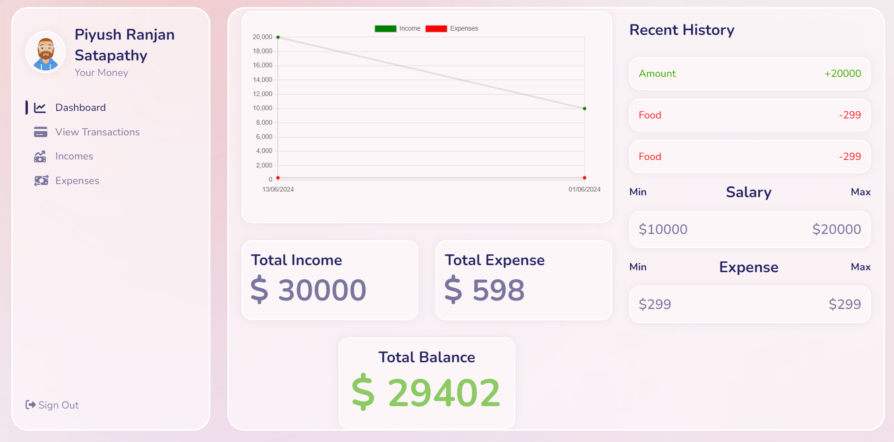

# Expense Tracker



## Overview

Expense Tracker is a web application built with **React, Node.js, and MongoDB**. This app helps you track your expenses and provides insights on your income and spending through easy-to-read graphs and a user-friendly dashboard.

## Features

- Track your income and expenses
- Visualize your spending patterns with graphs
- User-friendly dashboard for quick insights

## Technologies Used

- **React** for the front-end
- **Node.js** for the back-end
- **MongoDB** for the database

## Getting Started

### Prerequisites

Make sure you have the following installed on your machine:

- Node.js
- MongoDB

### Installation

1. Clone the repository:
    ```sh
    git clone https://github.com/Alfa-Satapathy/Personalized-Expense-Tracker.git
    cd expense-tracker
    ```

2. Install the dependencies:
    ```sh
    npm install
    ```

3. Start the development server:
    ```sh
    npm start
    ```


For any inquiries, please contact me at [satapathy2003@gmail.com].

---

Stay on top of your finances with Expense Tracker! 💼📊💰

#React #NodeJS #MongoDB #ExpenseTracker #WebDevelopment #FinanceManagement
